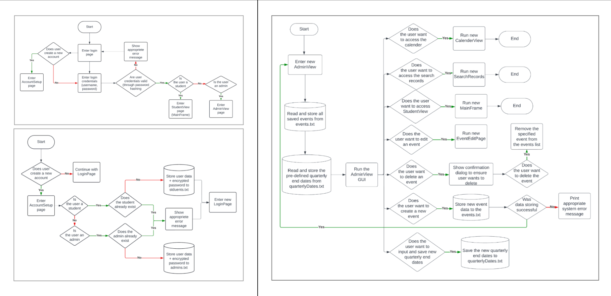

# SchoolSync

> 🏆 National Finalist — Top 10 @ FBLA CNLC 2023

A Java desktop application that centralizes school event management 
through role-based views, interactive calendars, and automated 
data handling for students and administrators.

---

## overview
School event participation typically relies on scattered announcements 
and manual spreadsheets. SchoolSync consolidates this into a single 
structured system with separate interfaces for each user role.

| View | What they can do |
|---|---|
| Student | Browse events, register, track participation, view leaderboard |
| Admin | Create/edit/delete events, manage student data, generate reports |

## key features
- **Role-based architecture** — distinct Student and Admin views reduce cognitive load
- **Interactive calendar** — visual event scheduling at a glance
- **Participation leaderboard** — ranks students by event engagement
- **File-based data persistence** — saves and restores state across sessions without a database
- **Validation + confirmation dialogs** — prevents accidental data loss on critical actions

## the tech stack
`Java` · `Swing GUI` · `Object-Oriented Design` · `MVC Pattern` · `File I/O`

## architecture
Built with a modular OOP structure — Students, Admins, and Events 
are independent classes. Data flows through a controller layer 
keeping UI and logic separated.



## run locally
```bash
git clone https://github.com/ShreyaSirgound/SchoolSync
cd SchoolSync
javac src/*.java
java -cp src Main
```

## built by
[Shreya Sirgound](https://shreyasirgound.github.io/portfolio-site/) + [Neo Tiwari](https://github.com/Neo2108) + [Ian Tang](https://github.com/iantang08) · Oct 2022 – Mar 2023
